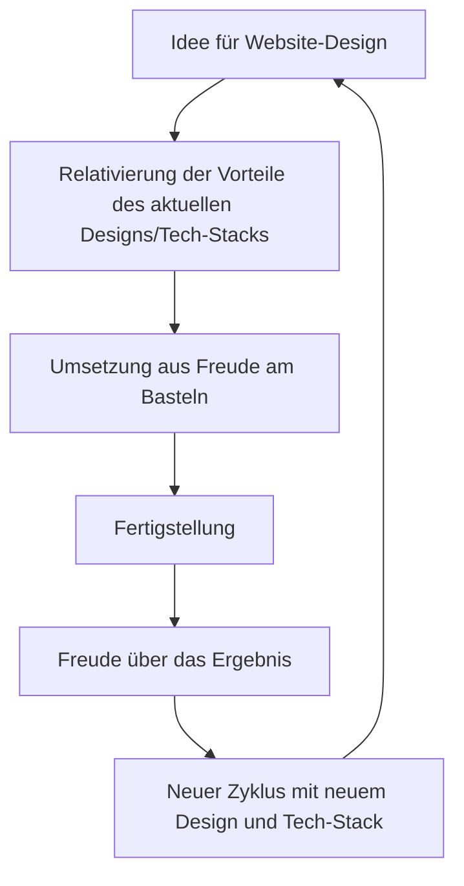

# Material for MKDocs + Flowinho = ❤️

Test

```mermaid
graph TD
  A[Idee für Website-Design]
  B[Relativierung der Vorteile des aktuellen Designs/Tech-Stacks]
  A --> B
  B --> C[Umsetzung aus Freude am Basteln]
  C --> D[Fertigstellung]
  D --> E[Freude über das Ergebnis]
  E --> F[Neuer Zyklus mit neuem Design und Tech-Stack]
  F --> A
```

Blubbern 

## Bilder Test

Was passiert wenn ich irgendwo im Text ein Bild hinzufüge?

{ width=300px; align=left }

dasdasdsadsadasdada

