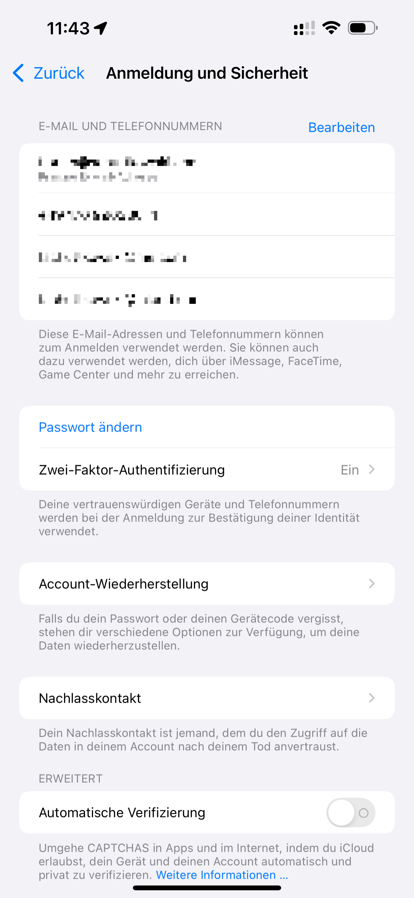

---
tags:
    - Apple
    - iOS18
    - iCloud
    - Privatsphäre
    - Sicherheit
---

# iOS 18 - Einstellungen für Privatsphäre und Sicherheit

Diese Übersicht wurde geschrieben, um einen Einblick in die Einstellungen für Privatsphäre und Sicherheit zu bieten. Sie richtet sich an Nutzer:innen, die sich mit diesen Themen auseinandersetzen wollen und sich von meiner Herangehensweise inspirieren lassen wollen.

<!-- more -->

!!! danger "Keine Haftung"

    Ich stelle hier in diesem Überblick **meine** Einstellungen und Herangehensweisen für **mein** iPhone dar. Wenn Leser:innen diesem Guide folgen, müssen sie sich im Klaren sein, dass bei falscher Handhabung der Einstellungen Konsequenzen entstehen können. Diese können beinhalten, sind aber nicht beschränkt auf:

    - Permanenter Zugriffsverlust auf den eigenen Apple Account.
    - Zugriff auf den Apple Account durch Dritte.

## Apple Account, iCloud und mehr

Diese Seite gibt eine Übersicht über die spezifischen Einstellungen zum Apple Account im Allgemeinen, zum Thema Sicherheit und bietet unter anderem Optionen zur Verwaltung der iCloud Funktionalitäten.

### Persönliche Daten

Hier können relevante Informationen zur Nutzer:in geändert werden.

#### Name
Hier sollten die Informationen nur mit Vorsicht von der Realität abweichen. Apple nutzt die hier hinterlegten Informationen unter anderem zum Abgleich der Person die den Account besitzt. Fantasie-Namen sind hier zwar möglich, obliegen aber der Entscheidung der Nutzer:innen. 

#### Geburtsdatum
Dieses Geburtsdatum wird unter anderem für den Nachlasskontakt benötigt, falls er/sie konfiguriert wurde. Da das Datum ebenfalls zumindest teilweise für die Alterskontrolle bei Inhalten genutzt wird, ist insbesondere bei Verwendung des Nachlasskontakts zu empfehlen, das echte Geburtsdatum anzugeben.

!!! info "Alterskontrolle bei Inhalten"

    Ob das in diesem Feld hinterlegte Geburtsdatum als alleinige Altersbestimmung zur Kontrolle der Medieninhalte benutzt wird, ist umstritten. Es gibt / gab die Möglichkeit, dieses Datum separat zu hinterlegen. Wie so oft bei Apple sind die tatsächlich genutzten Datenfelder nicht immer konkret nachzuvollziehen. Diese Aussage betrifft **nicht** den Nachlasskontakt. Dieser benötigt **zwingend** das korrekte Geburtsdatum.

#### Kommunikationseinstellungen

##### Ankündigungen

Dieses Feld sollte deaktiviert werden. Nicht nur wird diese zusätzliche Spam meiner Meinung nach nicht benötigt, sondern die im Apple Account hinterlegte Emailadresse wird möglicherweise nicht an Werbepartner weitergegeben.

##### Apps, Musik, TV und mehr

Dieses Feld sollte deaktiviert werden. Nicht nur wird diese zusätzliche Spam meiner Meinung nach nicht benötigt, sondern die im Apple Account hinterlegte Emailadresse wird möglicherweise nicht an Werbepartner weitergegeben.

### Anmeldung und Sicherheit

{ width=300px; align=right }

Cillum aliqua commodo nisi reprehenderit labore sunt enim anim ipsum. Incididunt quis ut in incididunt excepteur non. Est ad Lorem enim deserunt. Sint nisi duis nostrud eu cillum voluptate consectetur ullamco nulla eiusmod reprehenderit. Veniam aliqua culpa anim fugiat id id dolor pariatur sunt nostrud deserunt amet. Qui cupidatat eiusmod sit ad amet eu in laboris veniam occaecat aliqua reprehenderit fugiat non.

#### E-Mail und Telefonnummern

Do velit veniam deserunt occaecat fugiat aliquip. Laboris elit exercitation mollit id nostrud qui id dolor reprehenderit ex. Eu exercitation ad eiusmod proident sit deserunt. Tempor et enim esse ex proident irure sint magna cupidatat et. Elit eu nulla et elit sint. Sunt eiusmod amet proident laborum aliqua irure dolor culpa sunt esse laboris ipsum. Minim laborum occaecat proident et commodo qui irure adipisicing.

#### Zwei-Faktor-Authentifizierung

Do velit veniam deserunt occaecat fugiat aliquip. Laboris elit exercitation mollit id nostrud qui id dolor reprehenderit ex. Eu exercitation ad eiusmod proident sit deserunt. Tempor et enim esse ex proident irure sint magna cupidatat et. Elit eu nulla et elit sint. Sunt eiusmod amet proident laborum aliqua irure dolor culpa sunt esse laboris ipsum. Minim laborum occaecat proident et commodo qui irure adipisicing.

#### Account-Wiederherstellung

Do velit veniam deserunt occaecat fugiat aliquip. Laboris elit exercitation mollit id nostrud qui id dolor reprehenderit ex. Eu exercitation ad eiusmod proident sit deserunt. Tempor et enim esse ex proident irure sint magna cupidatat et. Elit eu nulla et elit sint. Sunt eiusmod amet proident laborum aliqua irure dolor culpa sunt esse laboris ipsum. Minim laborum occaecat proident et commodo qui irure adipisicing.

#### Nachlasskontakt

Do velit veniam deserunt occaecat fugiat aliquip. Laboris elit exercitation mollit id nostrud qui id dolor reprehenderit ex. Eu exercitation ad eiusmod proident sit deserunt. Tempor et enim esse ex proident irure sint magna cupidatat et. Elit eu nulla et elit sint. Sunt eiusmod amet proident laborum aliqua irure dolor culpa sunt esse laboris ipsum. Minim laborum occaecat proident et commodo qui irure adipisicing.

#### Automatische Verifizierung
